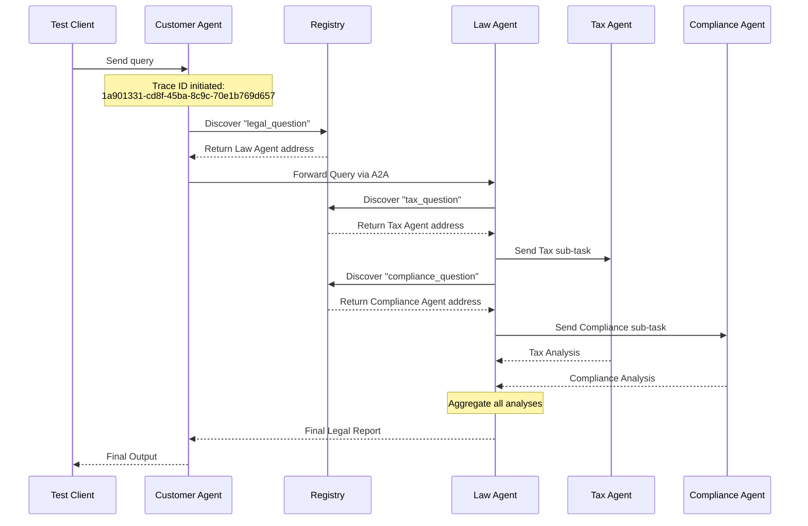

# Sequence Diagram: Request Flow

Dựa vào `trace_id` `1a901331-cd8f-45ba-8c9c-70e1b769d657` được ghi nhận trong logs, luồng xử lý (request flow) của hệ thống A2A được mô tả như sau:

## Bài tập 5.1: Trace Request Flow
Các Agent trong hệ thống giao tiếp với nhau bằng giao thức HTTP phân tán. Dù khác Process và Port, nhưng chúng đều truyền chung một `trace_id` trong HTTP Header để đồng bộ hoá phiên thảo luận. Nhờ có `trace_id` này, chúng ta có thể dễ dàng xâu chuỗi Log của 5 server lại thành một luồng (flow) thống nhất.
